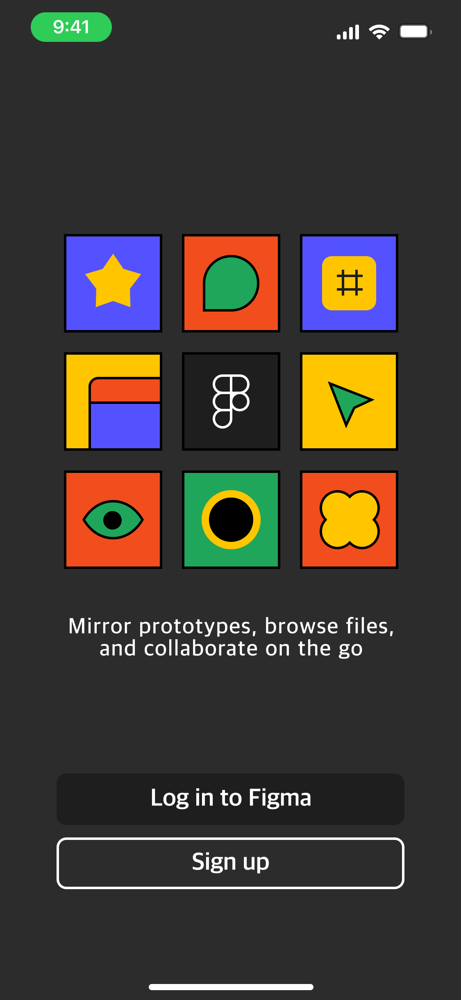

# Figma SmartAnimation design '#' 1개 ~ 6개 까지 가능, 6개가 가장 작은 제목
-마크다운으로 이미지 넣는 방법 

<figure style="text-aline:center;">

<figcaption>몬스터 앱 디자인</figcaption>
</figure>

마크다운 문법
굵은 글씨 기울임 취소선

구분선
링크넣기
링크자료

이미지넣기
이미지

코드넣기(백틱사용) 인라인
let a = 5

코드넣기 블럭
js
const a = 5
html
WOW
css
h1 { background-color:tomato }
목록만들기
첫번째 목록
두번째 목록
서브 목록
순서목록 A
순서목록 B
체크목록
 미완료
 완료
인용문
인용문입니다.

Git 명령어
초기화
git init

File Staging
git add .

Commit 기록하기
git commit -m '메세지'

원격저장소와 연결
git remote add origin URL

원격저장소와 연결 확인
git remote -v

원격저장소와 해제
git remote remove origin

원격저장소에 업로드하기(반영하기)
git push origin main git push -u origin main -> 이다음번에는 git push 만 하면됨.

자주쓰는것 정의하기
git config --global alias.ac '!git add . && git commit -m'
git config --global alias.acp '!git add . && git commit -m "update" && git push origin main"